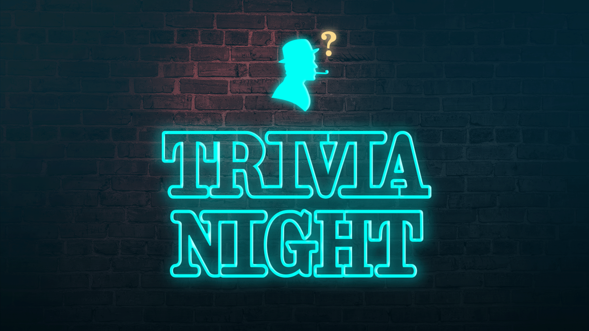
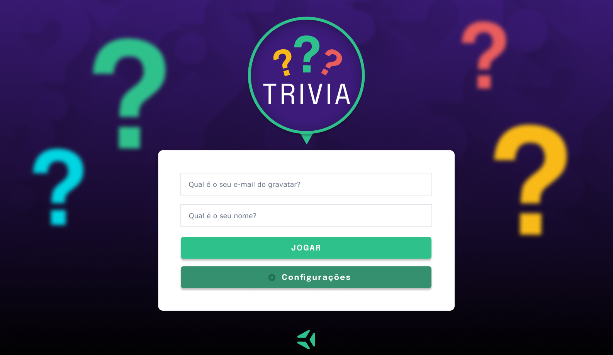
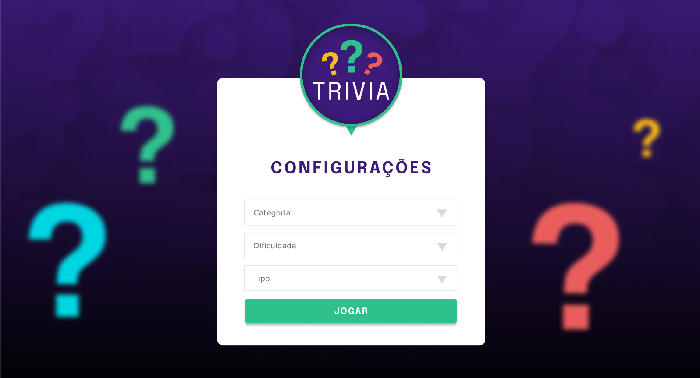
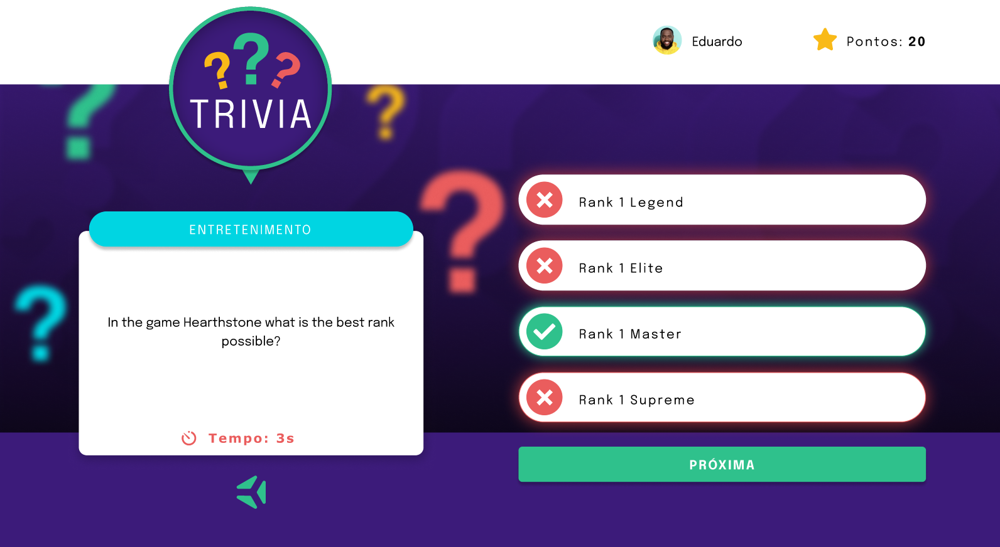
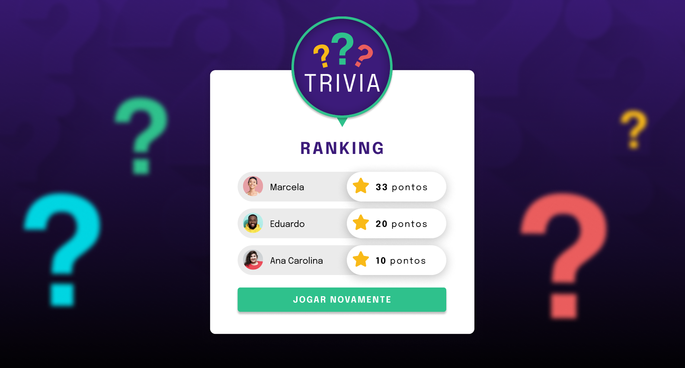

# Boas-vindas ao repositório do projeto de Trivia!

Seja muito bem-vindo(a) ao repositório do Projeto Trivia Aqui você encontrará informações sobre o que foi desenvolvido neste projeto, bem como os principais aprendizados adquiridos durante o processo, para adquirir esse conhecimento, basta clicar na seta abaixo que o conteúdo se abrirá, boa leitura, espero que goste. 🙂

 

  
<strong>👨‍💻 O que eu desenvolvi</strong>
 

Eu desenvolvi um jogo de perguntas e respostas baseado no jogo **Trivia** _(tipo um show do milhão americano rs)_, utilizando React e Redux. Desenvolvemos em grupo as funcionalidades de acordo com as demandas definidas em um quadro Kanban. Para que pudéssemos vivenciar um cenário mais próximo do mercado de trabalho, utilizamos esse quadro no grupo. Foi de suma importância que o nosso grupo se organizasse utilizando o quadro para maior eficiência e para minimizar os conflitos que a união de vários códigos traria. A partir dessas demandas, concluímos uma aplicação onde a pessoa usuária poderá:

  - Logar no jogo e, se o email tiver cadastro no site [Gravatar](https://pt.gravatar.com/), ter sua foto associada ao perfil da pessoa usuária.
  - Acessar a página referente ao jogo, onde se deverá escolher uma das respostas disponíveis para cada uma das perguntas apresentadas. A resposta deve ser marcada antes do contador de tempo chegar a zero, caso contrário a resposta deverá ser considerada errada.
  - Ser redirecionada, após 5 perguntas respondidas, para a tela de score, onde o texto mostrado depende do número de acertos.
  - Visualizar a página de ranking, se quiser, ao final de cada jogo.
  - Configurar algumas opções para o jogo em uma tela de configuração acessível a partir do cabeçalho do app.

 

  
<strong>Habilidades Adquiridas após realizar este projeto</strong>
 

Nesse projeto, eu fui capaz de:

  - Criar um store Redux em aplicações React

  - Criar reducers no Redux em aplicações React

  - Criar actions no Redux em aplicações React

  - Criar dispatchers no Redux em aplicações React

  - Conectar Redux aos componentes React

  - Criar actions assíncronas na sua aplicação React que faz uso de Redux.

  - Escrever testes para garantir que sua aplicação possua uma boa cobertura de testes.

  - Me desenvolvi ainda mais em soft-skills conseguindo melhorar ainda mais a minha habilidade de trabalhar em equipe.

 

 

 

 

 

 

 
